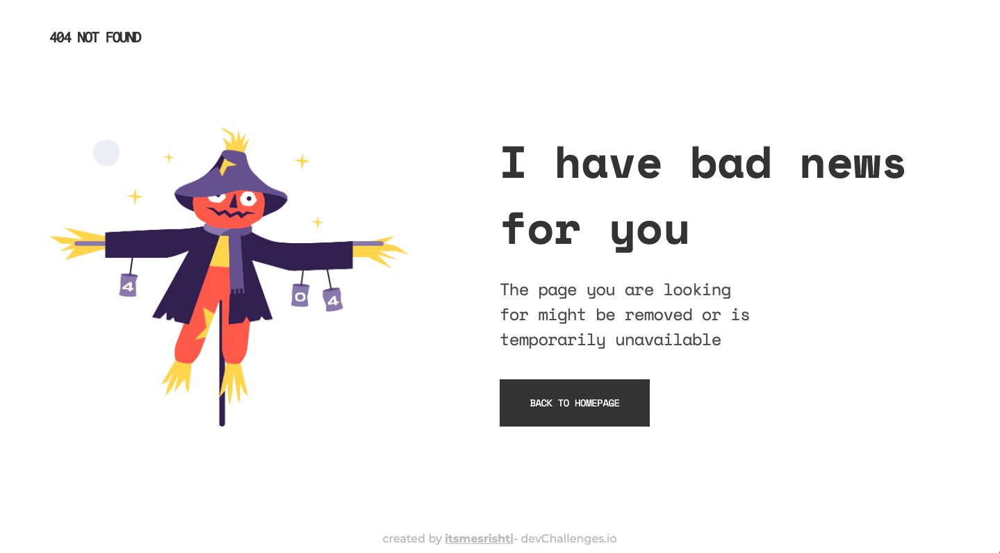

<!-- Please update value in the {}  -->

<h1 align="center">404 NOT FOUND</h1>

   Solution for a challenge from  <a href="http://devchallenges.io" target="_blank">Devchallenges.io</a>.

  <h3>
    <a href="https://devchallenges-responsivepath-project1.onrender.com/" target="_blank">
      Demo
    </a>
     | 
    <a href="https://github.com/itsmesrishti/devchallengesresponsivepath/tree/main/404-not-found-master" target="_blank">
      Solution
    </a>
     | 
    <a href="https://devchallenges.io/challenges/wBunSb7FPrIepJZAg0sY" target="_blank">
      Challenge
    </a>
  </h3>

<!-- TABLE OF CONTENTS -->

## Table of Contents

- [Overview](#overview)
  - [Built With](#built-with)
- [Features](#features)
- [Contact](#contact)
- [Acknowledgements](#acknowledgements)

<!-- OVERVIEW -->

## Overview

- **Where can I see your demo?** 
  You can see me demo here: https://devchallenges-responsivepath-project1.netlify.app/
  
- **What was your experience?** 
  The experience was fun and a little bit taxing trying to make the text and image adjust in such a way that neither is disproportionately bigger than the other.
  
- **What have you learned/improved?** 
  I even made the image responsive and I learned that sometimes the solution is simple silly.
  
- **Your wisdom? :)** 
  Sometimes, the solution is simple, you don't have to think or try too hard.

### Built With

<!-- This section should list any major frameworks that you built your project using. Here are a few examples.-->

- [HTML](https://developer.mozilla.org/en-US/docs/Web/HTML)
- [CSS](https://developer.mozilla.org/en-US/docs/Web/CSS)

## Features

<!-- List the features of your application or follow the template. Don't share the figma file here :) -->

This application/site was created as a submission to a [DevChallenges](https://devchallenges.io/challenges) challenge. The [challenge](https://devchallenges.io/challenges/wBunSb7FPrIepJZAg0sY) was to build a 404 page.

## Acknowledgements

<!-- This section should list any articles or add-ons/plugins that helps you to complete the project. This is optional but it will help you in the future. For exmpale -->

- [Render](https://render.com/) for hosting

## Contact

- Website: [itsmesrishti.github.io](https://{itsmesrishti.github.io/})
- GitHub: [@itsmesrishti](https://{github.com/itsmesrishti})
- LinkedIn: [Srishti Chaudhary](https://{https://www.linkedin.com/in/srishtichaudhary/})
