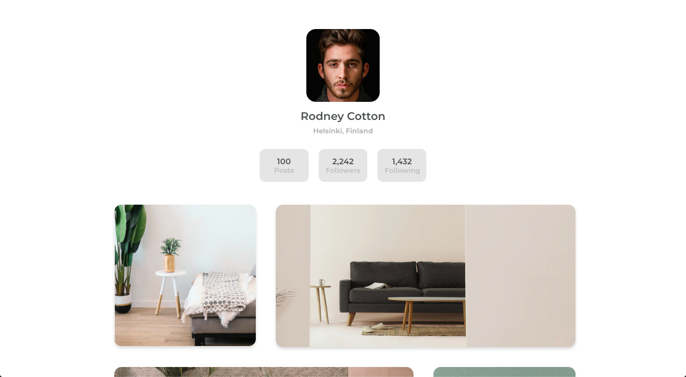

<!-- Please update value in the {}  -->

<h1 align="center">Gallery page</h1>

   Solution for a challenge from  <a href="http://devchallenges.io" target="_blank">Devchallenges.io</a>.

  <h3>
    <a href="https://devchallenges-responsivepath-project5.onrender.com/">
      Demo
    </a>
     | 
    <a href="https://github.com/itsmesrishti/devchallenges-responsivepath/tree/main/my-gallery-master">
      Solution
    </a>
     | 
    <a href="https://devchallenges.io/challenges/gcbWLxG6wdennelX7b8I">
      Challenge
    </a>
  </h3>

<!-- TABLE OF CONTENTS -->

## Table of Contents

- [Overview](#overview)
  - [Built With](#built-with)
- [Features](#features)
- [Contact](#contact)
- [Acknowledgements](#acknowledgements)

<!-- OVERVIEW -->

## Overview

Introduce your projects by taking a screenshot or a gif. Try to tell visitors a story about your project by answering:

- **Where can I see your demo?** 
  You can see my demo here: https://devchallenges-responsivepath-project5.netlify.app/
  
- **What was your experience?** 
  I enjoyed creating the gallery page and figuring out how to make images and the design fully responsive.
  
- **What have you learned/improved?** 
  I added a new feature: a carousel. User can click on an image to view the expanded version of the image and navigate to other images too through a carousel.

### Built With

<!-- This section should list any major frameworks that you built your project using. Here are a few examples.-->

- [HTML](https://developer.mozilla.org/en-US/docs/Web/HTML)
- [CSS](https://developer.mozilla.org/en-US/docs/Web/CSS)
- [JavaScript](https://developer.mozilla.org/en-US/docs/Web/JavaScript)

## Features

<!-- List the features of your application or follow the template. Don't share the figma file here :) -->

This application/site was created as a submission to a [DevChallenges](https://devchallenges.io/challenges) challenge. The [challenge](https://devchallenges.io/challenges/gcbWLxG6wdennelX7b8I) was to create a gallery page. Had to translate the Figma design into code, added a new feature: carousel.

## Acknowledgements

<!-- This section should list any articles or add-ons/plugins that helps you to complete the project. This is optional but it will help you in the future. For exmpale -->

- [Render](https://render.com/) for hosting

## Contact

- Website: [itsmesrishti.github.io](https://{itsmesrishti.github.io/})
- GitHub: [@itsmesrishti](https://{github.com/itsmesrishti})
- LinkedIn: [Srishti Chaudhary](https://{https://www.linkedin.com/in/srishtichaudhary/})
